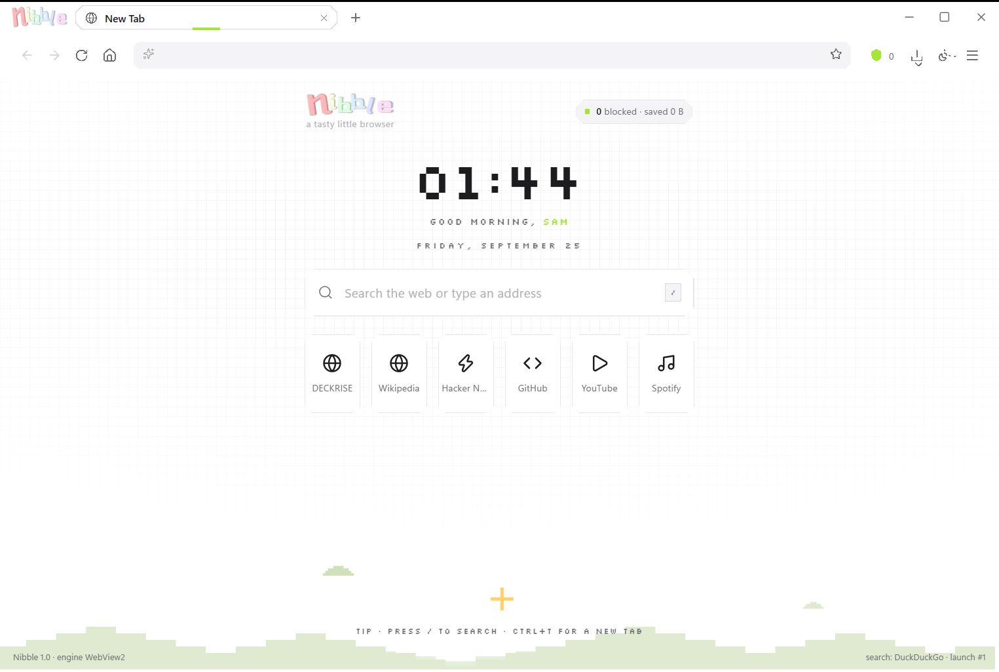
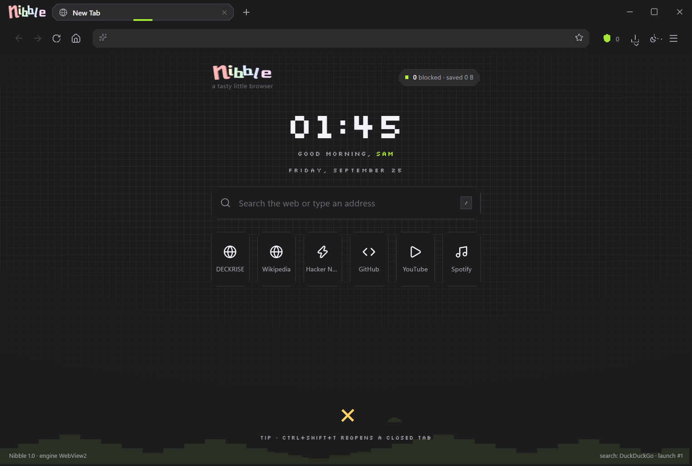
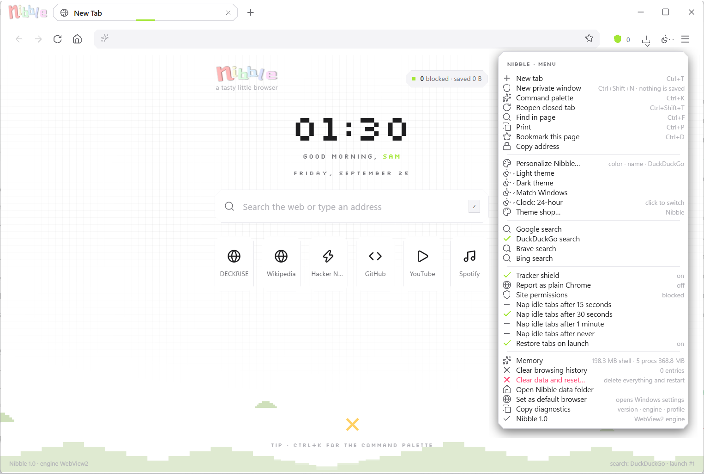
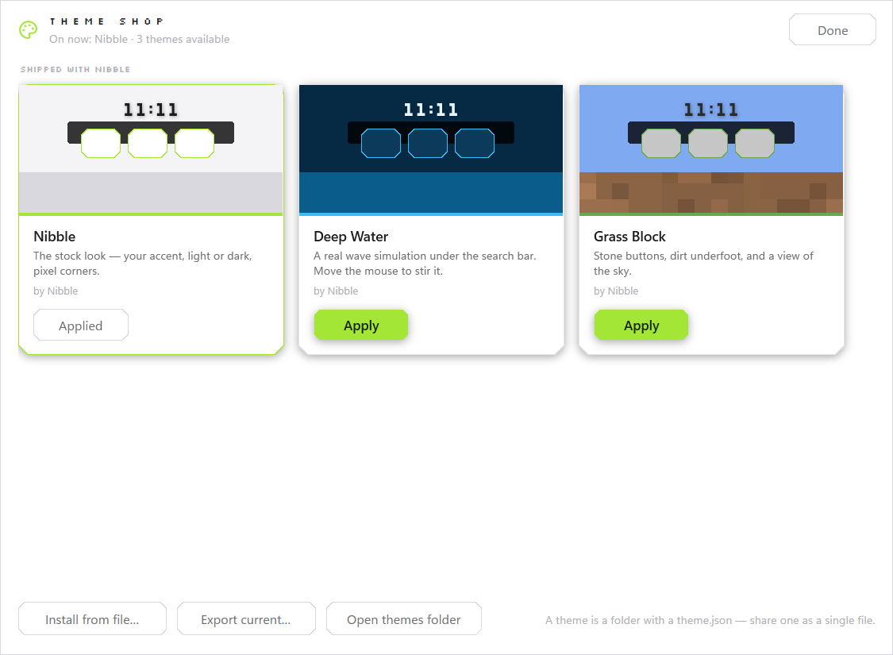
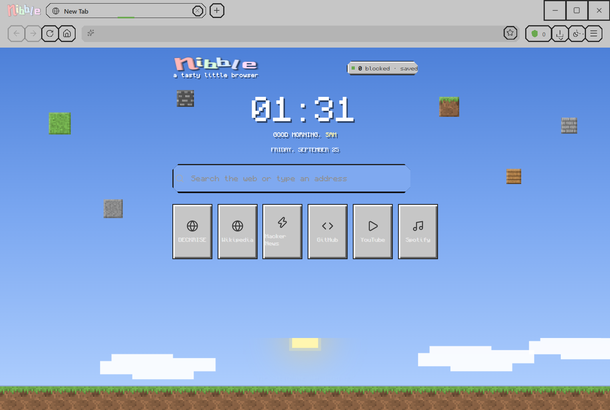
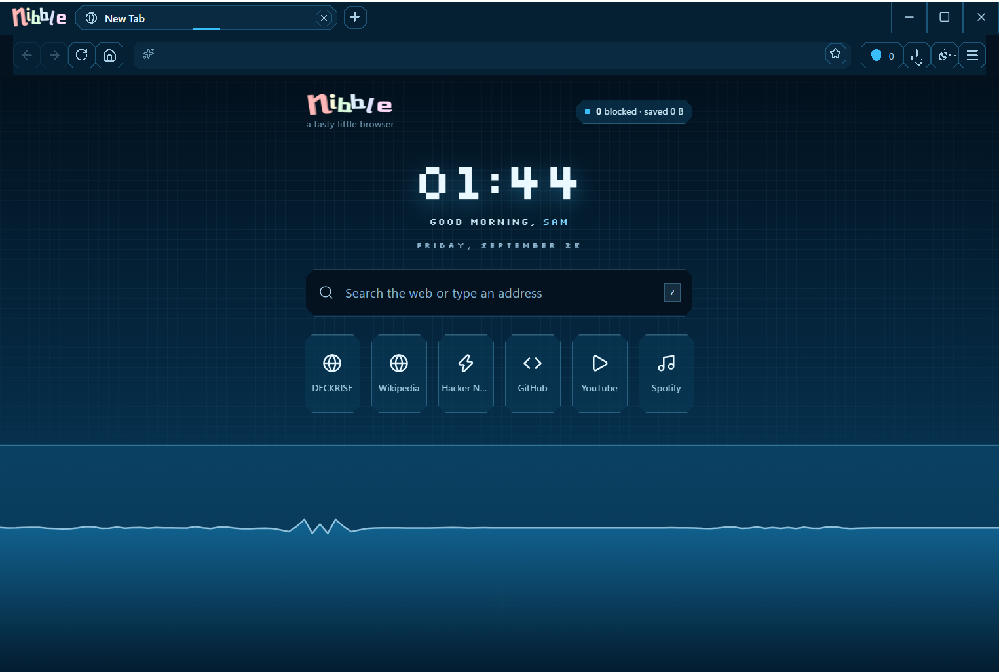
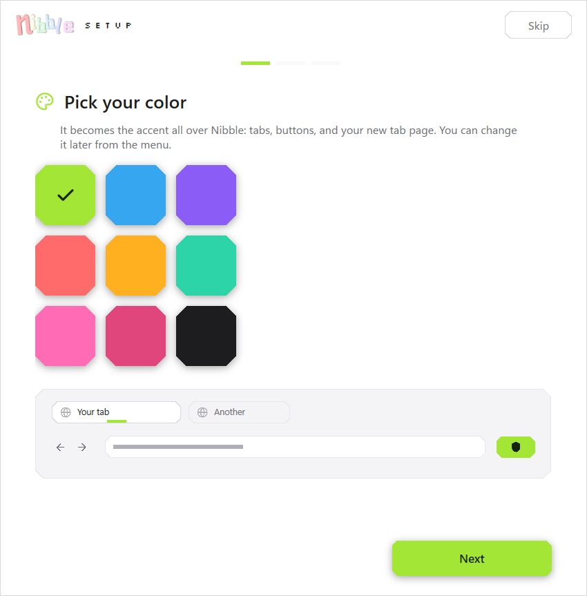
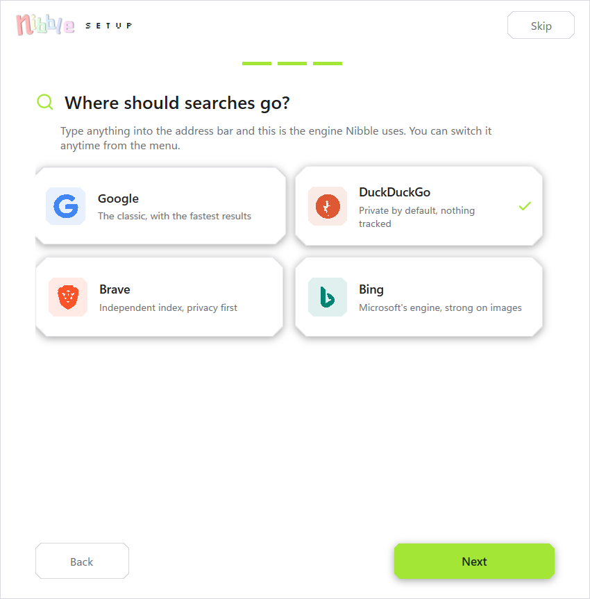
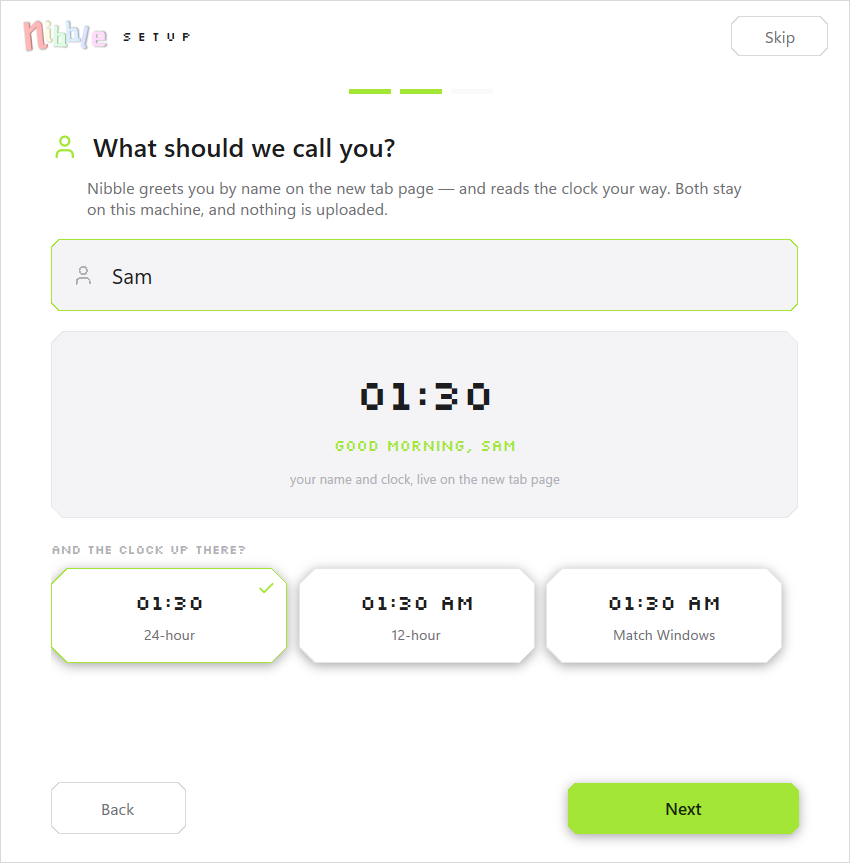
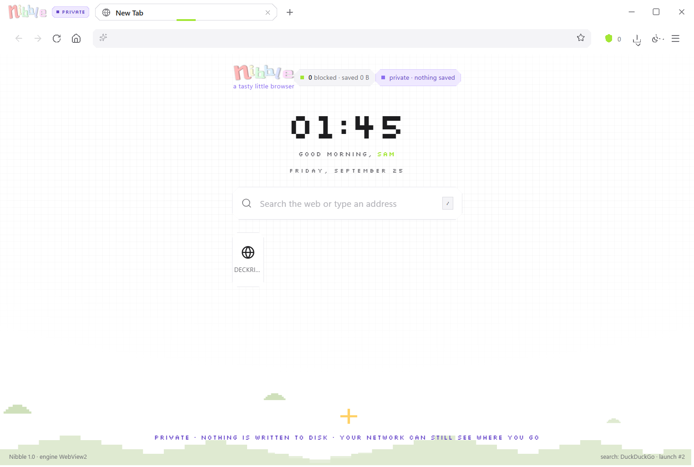

# Nibble


**A free, open-source web browser for Windows in under 2.2 MB.** Not a Chromium build — a
shell over the Chromium engine Windows already ships (Microsoft Edge WebView2), which is why
the whole browser is one exe you can email to somebody.

Apple-clean with a pixel streak: smooth open-source vector icons, stair-stepped pixel corners,
one accent colour you choose, hairline separators, springy 120–240 ms motion, and a real
Chromium engine underneath — the one Windows keeps patched for you.

No telemetry, no accounts, no services, no bloat, and nothing left running when the last window
closes. **MIT licensed: fork it, rebrand it, and ship it as your own browser** — see
[Make it your browser](#make-it-your-browser).

## Gallery

| The home page | Dark mode |
|---|---|
|  |  |

| The menu | The theme shop |
|---|---|
|  |  |

| Grass Block (Minecraft-flavoured) | Deep Water (a real wave simulation) |
|---|---|
|  |  |

| Setup: your colour | Setup: your search engine |
|---|---|
|  |  |

| Setup: your name and clock | Private window |
|---|---|
|  |  |

Every image above is generated from the shipping build by `tools/Shots.ps1`, so they cannot
drift away from the app.

## Install

**[Download the installer](https://github.com/DallenLarson/nibble/releases/latest)** —
`Nibble-1.1.2-Setup.exe`, 2.8 MB. (`Nibble.exe` on its own is there too, for a machine you
would rather not install to.)

It is a per-user Inno Setup installer — no administrator prompt, files in
`%LocalAppData%\Programs\Nibble`, Start-menu entries for Nibble and for a private window, an
entry in **Apps & features**, and a real uninstaller that keeps your browsing profile unless
you ask it to delete it. Installing also offers Nibble to Windows' browser list.

Build the browser and the installer in one command:

```
powershell -File tools/package.ps1
  -> dist/Nibble.exe              under 2.2 MB, the whole browser
  -> dist/Nibble-1.1.2-Setup.exe  the installer
```

That needs the .NET SDK, and [Inno Setup 6](https://jrsoftware.org/isdl.php) for the installer
(without Inno it builds the browser and says it skipped the Setup.exe).

> **None of it is code-signed yet.** On a Windows 11 machine with Smart App Control switched
> on, Windows refuses to run unsigned binaries — not a warning, a block. See
> [Before you ship it to strangers](#before-you-ship-it-to-strangers); it is the one thing
> standing between this source and a stranger's PC.

## Why it is this small

Most browsers ship their own copy of Chromium: 150–300 MB of engine, its own updater, its own
process for patching it. Nibble ships **none of that**. It drives the WebView2 runtime that
Windows already has — the same Chromium Microsoft Edge uses, already installed on Windows 10
and 11, already kept current by Edge Update. Nibble is the part you can actually see: the
chrome, the tabs, the home page, the themes, the privacy settings.

That is the whole trick, and it buys a lot:

| | Nibble | A browser that bundles Chromium |
|---|---|---|
| Download | one ~2.2 MB exe | 80–150 MB |
| Build it yourself | seconds (no engine checkout, no `gn gen`) | hours, tens of GB of toolchain |
| Engine updates | Microsoft's, monthly, automatic | the browser's own job, forever |
| Memory | just the pages you have open | engine code that has to live somewhere |

It costs something too, and it is worth saying plainly: the engine is not yours to patch, so a
Chromium vulnerability is Microsoft's to fix and not something Nibble can ship around. Chrome
Web Store extensions cannot work — WebView2 does not run them. And the two pieces it needs
(.NET 8 Desktop Runtime and WebView2) are both things Windows already ships, and the installer
checks for both.

## Make it your browser

Nibble is **MIT licensed** and built to be taken: one project, no Chromium to check out, a full
build in seconds, and a `docs/rebranding.md` that lists every place the name, artwork and URLs
live — including the five that break something if you miss them (the assembly name, the pack
URIs, the installer's AppId, the profile folder, and the update feed).

Rename it, drop in your own logo and accent, point the updater at your own releases, and it is
your browser. The parts that cost real money elsewhere — the engine, its update pipeline, the
rendering, the sandbox, the network stack — are the parts Windows gives you.

## Updates

Nibble keeps an installed copy current by itself. Eight seconds after a window is up — at most
once every six hours — it asks its own release feed
(`https://api.github.com/repos/DallenLarson/nibble/releases/latest`) whether a newer version
exists. If one does, it downloads the `Nibble-<version>-Setup.exe` that release carries into
`%AppData%\Nibble\updates` and installs it **at the next launch**, before any window exists:
the installer replaces the build, starts the new one, and the new build says so once. Nothing
about the profile is touched.

Menu → **Check for updates** does it on demand and shows where it stands. When an update is
ready the toast offers *restart now* for anyone who would rather not wait. `--check-updates`
does the whole thing without a window and writes what happened to
`updates/last-check.json` (state, newest version, whether the installer came down) — that is
what the test and any script read.

**Honest limits.** The download is trusted because it came from this repository over TLS;
*nothing in an unsigned build can prove the installer is ours*, which is what a code-signing
certificate fixes. The size the feed reports is checked and a file that does not match is
thrown away, a copy that cannot install is not retried for six hours (so a broken update cannot
loop), and installers that are not newer than what is running are deleted on the next launch.
On a machine with Smart App Control on, the downloaded installer is refused like any other
unsigned binary. This is also the only request Nibble makes without being asked —
`Settings.Updates` turns it off, see [Telemetry and privacy](#telemetry-and-privacy).

## Run it

Double-click `Nibble.exe`.

Requirements:

- **WebView2 runtime** — ships with Windows 10/11 and Microsoft Edge. Nibble does not
  bundle a browser engine; it drives the one the OS already has. If it is missing, Nibble
  says so and offers the download link instead of failing quietly.
- **.NET 8 Desktop Runtime** — the single-file exe is framework-dependent, which is what
  keeps it at 2.2 MB. For a machine without it, publish self-contained
  (`--self-contained true -p:EnableCompressionInSingleFile=true`, ~65 MB).

### Command line

```
Nibble.exe https://example.com          open a link, or add a tab if already running
Nibble.exe --private                    a private window (Ctrl+Shift+N does the same)
Nibble.exe --private <url>              a private window pointed at a page
Nibble.exe --new-window                 a second normal window
Nibble.exe --register-browser           what an installer calls: write the browser entries
Nibble.exe --unregister-browser         what an uninstaller calls: take them back out
Nibble.exe --check-updates              ask the release feed, fetch the installer, write the
                                        result to updates/last-check.json, exit (no window)
```

**One browser per user.** A second launch does not start a second copy — it hands its
command line to the running window through a named pipe and exits, so a link clicked in
another app arrives as a tab. If nothing is listening (an older build, a wedged one) the
new process starts its own window rather than swallowing the click.

### Being the default browser

Menu → *Set as default browser* (or `Nibble.exe --register-browser`) writes Nibble's
per-user browser entries — `HKCU\Software\Classes\NibbleHTML`, the Start-menu internet
client capabilities, `http`/`https` URL associations — and then opens the Windows page
where you pick a default. Since Windows 10 no app can make itself the default; only the
user can, in Settings. All of it lands under `HKCU`: no admin rights, nothing
machine-wide. The installer writes those entries itself (and `--unregister-browser` takes them
back out, for a portable copy); uninstalling removes them through `[Registry]`
`uninsdeletekey` flags, so nothing is left pointing at a deleted folder. Registration used to
be done by launching the browser and waiting for it, which is what made 1.0.0 hang on a
machine where the browser could not start — see the changelog.

## The window

Everything lives in one header row, level with the tabs:

```
[logo]   [ tab ] [ tab ] [+]  ······drag here······   –   □   ✕
         \____________ tabs ___________/            window controls
```

- **Tabs stretch when there are few** — one tab fills ~320 px so you can read the title;
  they shrink evenly as you open more (down to 112 px, then the strip scrolls with the
  mouse wheel).
- **Every tab shows its favicon**, with a crisp pixel globe as the fallback.
- **A tab can be dragged.** Sideways reorders the strip, and letting go *below* the strip (or
  outside the window) hands the tab to a window of its own, placed under the pointer — drop it
  on another Nibble window instead and that window takes it. A ghost of the tab follows the
  pointer and goes paler once letting go would make a window rather than a tab; escape calls
  the drag off. The drag is followed through the window's own message hook rather than WPF
  mouse events, because the interesting half of a drag happens over the engine's child window.
- **Closing a lot of tabs takes one gesture.** Right-click any tab: close tab, **close other
  tabs**, **close tabs to the right** — each showing how many it would close — duplicate, pin,
  or move to a new window. The close mark itself is a 26 px button with a 14 px glyph and a red
  hover tint, up from a 20 px button with a 12 px glyph, and a middle-click still closes.
- **A page that opens a window gets a real window**, which is what a sign-in flow needs:
  `window.opener` is there, session storage is shared, and it can post back to the page that
  opened it. (The engine only finishes starting once its window exists, so the window is shown
  before the page is handed over — building it first is what used to leave Google sign-in
  hanging with *missing initial state*.)
- **Opening a link in a new tab keeps you where you are.** Ctrl-click, a middle-click and the
  link menu's **Open link in new tab** open the tab behind you and leave you reading the page
  you were on; a plain click on the same link still brings its tab to the front. The engine
  never says which gesture opened a tab, so the page reports it and Nibble acts on that name.
  The menu's **Open link in new window** opens a real window. Real clicks on a real desktop:
  **15 of 15 checks** in `tools/LinkFocusProbe.ps1`.
- **Sound is never slept on.** A tab that is playing audio is left alone by the
  sleeping-tab timer, and stays exempt for twenty seconds after the last sound, so a pause or a
  buffer does not get a video put to sleep mid-play.
- **New tab button sits directly to the right of the last tab**, not pinned to the edge.
- **Minimize / maximize / close live on the right of the tab row** and take their
  traffic-light colour on hover: close **red**, minimize **yellow**, maximize **green**,
  with a dark glyph on the colour. The empty strip between the two is draggable, and
  double-clicking it zooms.
- Those three buttons (and every other control in the header) report themselves as client
  area, not as the window's resize border. Without that, their outer pixels answered as
  "resize" and the pointer flickered between an arrow and a resize cursor as it crossed
  them — the housing sits flush against the top and right edges, inside the 6 px border.
- This window is its own chrome, so the maximize button deliberately does **not** report
  itself as the system maximize button: that is what makes Windows 11 hover its
  snap-layouts flyout over the button (the "second smaller button"). Snapping still works
  the normal ways — drag a window to a screen edge, or press <kbd>Win</kbd>+<kbd>Z</kbd>.
- **Full screen (F11) just is full screen**: the chrome slides away, the window fills the
  whole monitor including the taskbar, and nothing else appears — no badge, no toast.
  F11 or Escape brings the chrome back at the exact size and position you left.
  *Including the taskbar* is the part that needs saying twice: the taskbar is an
  always-on-top window, so a window that is merely the size of the monitor keeps its bottom
  edge under 60 px of Windows. Full screen therefore puts the window above everything and
  tells the shell it is full-screen, which is what makes Explorer take the taskbar away; the
  measurement is in the changelog for 1.1.1.
- **Menus and popups dismiss like you'd expect**: click anywhere outside them — on the
  page (including inside embedded frames), on the toolbar, on a tab — scroll the page,
  press Escape, or click the button that opened it again.
- **A popup never covers the button that opened it.** The menu card keeps a margin inside
  its popup window so the drop shadow has room; that invisible strip used to sit over the
  bottom of the hamburger. Hovering there dropped the button's hover state — the pointer
  flipped between the button's hand cursor and the popup's arrow — and clicking it hit the
  popup instead of the button, so the button could not close its own menu. Popups now start
  just below the anchor's bottom edge — with a few pixels of clearance, because
  device-pixel rounding still clipped the button's last row at 2 px — and their position is
  re-checked once everything has laid out, since a window that has just changed size could
  otherwise place them against a stale layout (measured once at 6 px). A long menu scrolls
  inside the window instead of being slid back up over the button by Windows, and an open
  menu follows the window when it is resized. Measured with each panel open, at two window
  sizes: 420 sample points across the button, **0 belonging to any other window** (it was
  273 of 420 on a 1000×620 window).
- **Tooltips sit below their button, never at the pointer.** A mouse-placed tooltip lands
  under the cursor as soon as the pointer moves, which takes the hover away from the button,
  hides the tooltip, gives the hover back, and repeats.

## First run: the setup wizard

On the very first launch Nibble opens a four-step setup window instead of a browser
window — frameless, pixel-stepped, animated, and every answer previews live:

1. **Pick your color** — nine curated color tiles. The whole wizard re-tints as you
   click, and a miniature of the real browser chrome (tab, omnibox, shield, loader)
   previews the choice.
2. **What should we call you?** — a big focus-aware field that glows in your accent,
   above a live, already-ticking preview of the new tab page. The same step asks how the
   clock should read: **24-hour** (military), **12-hour**, or **follow Windows**.
3. **Where should searches go?** — four search engines as cards with their smooth
   open-source brand marks (Google, DuckDuckGo, Brave, Bing).
4. **You're all set** — a recap, a pixel badge with a sparkle burst, and one button.

Enter advances, Escape skips, and skipping keeps every default. Answers land in
`settings.json`. **Change your mind later:** Menu → *Personalize Nibble…*.

## What's in it

| Area | What you get |
|---|---|
| Tabs | Stretch-to-fit widths, favicons, **drag to reorder or to pull a tab out into its own window**, right-click menu (close others, close to the right, duplicate, pin, move to a window), big close mark, middle-click close, animated activation, sleeping-tab badge, session restore, Ctrl+Shift+T reopen |
| Opening links | Ctrl-click, middle-click and the link menu's **Open link in new tab** open it *behind* you, so you keep reading what you were reading; a plain click on the same link still brings its tab to the front |
| Windows | Any number of them: one browser per user with command-line hand-off, URL on the command line, **pages that open windows get real windows** (sign-in flows, popups), the link menu's *Open link in new window* opens a real window, remembered size/position, default-browser registration |
| Private windows | Ctrl+Shift+N, a real off-the-record engine profile, its own look, shares one jar with other private windows, leaves nothing on disk |
| New tab page | Hand-built offline page: pixel clock, pixel-art scene, quick tiles from bookmarks and history, rotating tips, animated tracker counter. Scales with window height, and its search box is its own layer so suggestions open *over* the tiles |
| DECKRISE tile | `https://www.deckrise.net/` is pinned into the shortcut row by hand: it leads the row and is the only tile a private window shows. `PINNED` at the top of `Assets/newtab.html` |
| Address bar | Smart address-vs-search parsing, live history suggestions, keyboard-navigable dropdown, bookmark star, https/http lock chip |
| Command palette | Ctrl+K, 34 actions, tab/history/bookmark/closed-tab search, calculator, unit conversion |
| Find and print | Ctrl+F find bar with a match counter, F3 to step, Ctrl+P print |
| Tracker shield | Host-name blocker for 141 ad/tracker networks, per-tab counts, running "bytes saved" tally |
| Downloads | Live progress toast, click to open, session list in the menu |
| Themes | Light, dark, or follow Windows |
| Theme shop | Bundled themes plus anything you install, as cards with a preview painted from each theme's own colours. Apply, import, export, remove |
| Site permissions | Camera, microphone, location and notifications refused unless you turn the switch on |
| Memory | Idle background tabs are suspended to hand their memory back (the `z` badge) — anything playing sound is left alone; tab process count + RAM in the menu |
| Icons | Smooth open-source vectors (Lucide ISC + Simple Icons CC0), tinted by the accent |
| Error pages | Custom pixel page that names the host, explains what failed, and offers Retry / Back / **Open in your browser** / Copy address |
| Accessibility | Every button, tab close and menu row exposes a real name to Windows UI Automation |
| Compatibility | Optional "Report as plain Chrome" agent for sites that treat embedded browser engines as bots |

## Themes and the theme shop

Menu → *Theme shop…*, or `Ctrl+K` → *Theme shop*. Every theme is a card with a miniature of
its home page painted from its own colours — *Apply*, and the whole browser changes: chrome,
buttons, toasts, the address bar *and* the new tab page. The shop also does **Install from
file…**, **Export current…** (a theme is one `.json`/`.nibbletheme` file), **Remove** for
anything you installed, and **Open themes folder**.

The shop is local by design: it lists what ships plus everything in `%AppData%\Nibble\themes`.
That includes **Nibble** itself, the stock look, first in the list — so trying a theme is
never a one-way door. An online catalogue would need a host to point at; the format is
already the right shape for one.

### The two themes that ship

**Grass Block** — the Minecraft-flavoured one. Stone-grey chrome where every button gets a
2 px outline and an inner bevel, a sky-blue home page with white block clouds and a square
sun, floating blocks bobbing in the breeze, a grass-and-dirt horizon, and Monocraft type
carrying the game's hard text shadow.

**Deep Water** — deep blue, with an actual water surface on the home page: a 128-column
height field, spring-coupled and damped, stepped every frame in two layers for depth.
Droplets fall and splash, moving the pointer stirs it, clicking drops a splash in. Splashes
are volume-neutral, so the surface always levels out again.

Both are a *look-alike*, not a copy, and that is deliberate:

- Every block texture in `Assets/Themes/minecraft/blocks/` is drawn by
  `tools/Textures` — 16×16 pixel art from a fixed seed, byte-for-byte reproducible.
- The type is **Monocraft** (SIL OFL 1.1, licence shipped as `Monocraft-OFL.txt`).
- No Mojang art, font or code travels with Nibble.

### Writing your own

A theme is a folder with a `theme.json`:

```json
{
  "id": "sunset",
  "name": "Sunset",
  "author": "you",
  "tagline": "A warm evening look.",
  "base": "dark",
  "accent": "#FF8A5C",
  "colors": {
    "ChromeBg": "#241A22",
    "CardBg": "#2E2029",
    "Ink": "#FFEDE4",
    "ButtonStroke": "#4A3040",
    "ButtonStrokeThickness": 1
  },
  "page": { "css": "theme.css", "js": "theme.js" },
  "preview": { "sky": "#3A2233", "ground": "#7A3B2E", "button": "#3A2A33", "text": "#FFEDE4", "accent": "#FF8A5C" }
}
```

- `colors` keys are the palette names from `Themes/Light.xaml`; anything you leave out keeps
  the built-in value. `ButtonStroke` and `ButtonStrokeThickness` give the chrome's buttons an
  outline.
- `page.css` loads *after* the built-in page, so it wins; scope it under `body.theme-<id>`
  (the page adds that class for you).
- `page.js` may define `window.NibblePageTheme = { mount, unmount }`. `mount` is handed
  `{ body, stage, tiles, clock, accent, send }`; `unmount` is called before the theme is
  swapped out — that is how Deep Water tears its canvas and listeners down.
- Anything else in the folder (textures, fonts) is copied next to the page, so `theme.css`
  can reference it by relative path.

Bundled themes live in `Assets/Themes/<id>/`; installed ones in
`%AppData%\Nibble\themes\<id>\`. A hand-edited file is fine — the parser allows comments and
trailing commas.

## Private windows

Ctrl+Shift+N, or Menu → *New private window*. A private window is a real off-the-record
browsing session, not a window with the history switched off afterwards:

- **The engine runs an in-private profile.** Every tab in that window is created with
  `IsInPrivateModeEnabled`, so cookies, cache, local storage and history live in memory and
  are thrown away when the window closes. The normal profile on disk is never touched.
- **Nothing about it is recorded.** No history entries, no page counters, no session save,
  no quick tiles, and no history suggestions in the address bar.
- **It looks different on purpose** — a violet `PRIVATE` pill in the header, a
  *private · nothing saved* chip on the home page, a warning line along the bottom, and
  "(private)" in the window title.
- **Two private windows share one jar**, like every other browser.

The engine also starts with privacy switches that apply to every window: `--no-pings` (no
hyperlink-audit beacons), `--dns-prefetch-disable` (no speculative DNS for links you never
click), `--force-webrtc-ip-handling-policy=default_public_interface_only` (WebRTC cannot
hand a page your LAN address), plus Chromium's Cast/Media Router device discovery and
background networking/model downloads turned off.

**Measured, not asserted.** `tools/CookieServer.ps1` is a small offline HTTP server and
`tools/PrivateDiskTest.ps1` drives it:

| Check | Result |
|---|---|
| Normal window sets `nibbletest=normal`; a private window reads the jar | private: `cookie none` |
| Two private windows, one sets `prvtoken=secret` | the other private window: `cookie prvtoken=secret` |
| Normal window reads the jar again | still `nibbletest=normal` — never the private one |
| Cookies left on disk after the private windows closed | `nibbletest` present, `prvtoken` **absent** |
| History after private browsing | only the normal window's page |
| Profile folder while private windows ran | same file count: nothing that survived |

**What private does not do.** It cannot hide you from the network. Your router, your ISP and
anyone watching that Wi-Fi still see which hosts you reach — TLS hides page contents, not
destinations. That needs a VPN, and Nibble does not ship one.

## Find, print and site permissions

- **Find in page** (Ctrl+F, F3, or the menu) opens Nibble's find bar at the top-right of the
  page with a live `3/12` counter, Enter / Shift+Enter to step, Esc to close. It is a real
  popup because a WPF element over the page area is invisible: the engine's surface is its
  own window. The engine's newer `CoreWebView2Find` API measured **zero** matches here for
  text plainly on the page when started with `SuppressDefaultFindDialog`, so the bar counts
  visible text and jumps with the page's own `window.find`. That logic carries 16 assertions
  in `tools/FindLogicTest.js`.
- **Print** (Ctrl+P, or the menu) opens the engine's print dialog.
- **Site permissions are refused by default.** Pages are never quietly given the camera,
  microphone, location or notifications: a request is denied and a toast says who asked for
  what. Menu → *Site permissions* flips it to allowed, and the toast says so.
- **Copy diagnostics** puts versions, flags and paths on the clipboard — deliberately no
  history, no bookmarks, no URLs.

## The command bar (Ctrl+K)

One field, four kinds of answer, all instant:

- **Just type** — the top row searches with your engine, the rest come from history,
  bookmarks and open tabs.
- **`>` commands** — 34 of them. `> clear history`, `> mute site`, `> theme shop`,
  `> palette reset`, `> clear data and reset`, and so on.
- **`@` scopes** — `@tabs youtube`, `@history`, `@bookmarks`, `@closed`.
- **`=` and units** — `=8*8` answers 64 as you type; `10 km to mi` converts.

Arrow keys move, Enter runs, Escape closes. Paste a shared theme code and it offers to apply
it rather than searching for it.

## Migration: what actually comes across

`Ctrl+K → Import from another browser`, and the setup wizard offers it on the last screen.
It reads Chrome, Edge, Brave and Firefox profiles directly — no export files to prepare.

| Item | Status |
|---|---|
| Bookmarks | **imported** — Chromium `Bookmarks` JSON, Firefox `places.sqlite` |
| Default search engine | **imported** — from Chromium `Preferences`, or Firefox `prefs.js` |
| History, cookies, autofill, passwords, open tabs | **not yet** — these live in SQLite databases, SNSS session files and DPAPI-encrypted stores. The import screen says so plainly rather than pretending |

## Where your data lives

Everything is under `%AppData%\Nibble`:

| File | Contents |
|---|---|
| `settings.json` | accent, name, search engine, clock style, theme, shield on/off, site permissions, window size/position, nap timeout, session restore, setup-complete flag |
| `history.json` | last 900 visited pages |
| `bookmarks.json` | bookmarks |
| `session.json` | open tabs for the next launch |
| `stats.json` | lifetime blocked requests and estimated bytes saved |
| `pages/` | the built-in new tab and error pages, plus each theme's assets |
| `themes/` | themes you installed |
| `WebView2/` | the real browser profile: cookies, cache, local storage |
| `nibble.log` | only written if something throws |
| `reset.pending` | exists only between *Yes, wipe everything and restart* and the relaunch |

A **private window** adds nothing to any of this.

Menu → *Open Nibble data folder* shows the folder. For a second, completely separate profile,
set `NIBBLE_PROFILE` to a folder path before launching.

## Closing, force quit, and window lifetime

Closing is unconditional and immediate — a page cannot stall it:

- Every tab's engine is released as the window closes, so the Chromium processes go with it.
- A 1.5 s watchdog hard-exits if anything ever blocks the normal path.
- A `beforeunload` "leave site?" prompt is accepted for you instead of being shown.

There are two flavours of close:

| Gesture | Saves session | Use when |
|---|---|---|
| **Close** (the ✕, Alt+F4) | yes — tabs, history and stats are flushed | normal use |
| **Force quit** — Shift-click the ✕, or `Ctrl+K` → *Force quit Nibble* | no — the process ends immediately and nothing is written | the browser feels wedged |

Closing a window closes only that window. A private window outlives the last normal one, the
way it does in every other browser: the process ends when the last window of any kind is
gone, and the watchdog is armed only by that last window.

## Clear data and reset

Menu → *Clear data and reset…* puts Nibble back to a factory-fresh first run:

- **Two steps, never a landmine.** The row is drawn in the danger colour and opens a panel
  that names what goes before asking. Only then does *Yes, wipe everything and restart*
  appear. Cancel leaves everything alone.
- **Scope is the profile, nothing else.** Everything under `%AppData%\Nibble` is deleted; no
  other browser, folder or Windows setting is touched.
- **How the restart works.** The engine holds its profile open while Nibble runs, so instead
  of deleting it live, Nibble writes a `reset.pending` marker, releases every tab's engine,
  waits for the Chromium processes to exit, relaunches itself and quits. The new instance
  applies the wipe before it loads any profile, then comes up on the setup wizard. If a
  process were still holding a file, the marker survives and the next launch finishes the job.
- **Verified end to end** on a scratch profile: menu row → confirmation → old process exits →
  new process on "Set up Nibble" → profile empty (208 files became 0) → marker gone.

## Motion, and why the popups stay crisp

Squash and stretch run through one helper (`Controls/Juice.cs`): deformations preserve volume
(scaleX × scaleY ≈ 1), animate only `RenderTransform` and `Opacity` — so they stay on the
compositor and never trigger layout — and honour the Windows "show animations" setting.
Buttons lean towards the pointer and squash when pressed; tabs pop in and settle; menus,
toasts and the find bar spring into place; toasts squash out on their way.

Two things that are easy to get wrong here, both covered by tests:

- **The transform helpers are idempotent.** A popup's card is reused every time a menu opens;
  an earlier version wrapped a *new* scale transform around the old one on every open, so each
  previous squash stayed baked into the chain — which is why a menu looked progressively worse
  the more it was opened.
- **Popups carry their own layout rounding.** A `Popup` is a separate visual tree, so the
  window's `UseLayoutRounding` never reaches it; without it a card can land on a half pixel
  and its text renders soft.

## Performance and build verification

The shell is deliberately small; the engine is the one Windows already has.

| Fact | Value |
|---|---|
| `Nibble.exe` | 2,175,560 bytes (2.08 MiB) — one file, framework-dependent, no symbols |
| Host runtime | .NET 8, tiered compilation + TieredPGO on, server GC off |
| ReadyToRun | off: measured neutral at this size (~953 ms vs ~960 ms cold start) and +0.9 MB |
| Engine | WebView2 (Microsoft-signed, shared, updated by Edge Update) |
| Idle cost | measured ~94 ms CPU per 4 s (2.3% of one core) for shell + engine, animated home page |

Reproduce the host and engine facts:

```
dotnet run --project tools/VerifyBuild -- dist/Nibble.exe --object-dir src/Nibble/obj/Release/net8.0-windows/win-x64
```

**Honest limitation:** PGO and ThinLTO are build-time decisions inside Microsoft's engine and
cannot be observed in a shipped binary. What Nibble can prove is that it adds no build of its
own, ships no debug symbols, and drives a vendor release build of Chromium rather than a
hand-rolled one.

## Telemetry and privacy

Nibble has **no telemetry**. No analytics endpoints, no crash reporting service, no
"anonymous usage" ping, no account. The only network requests are the pages you ask for; the
only update path is Windows/Edge Update keeping the shared engine current. The tracker
shield's counts live in `stats.json` and never leave the machine.

One request is Nibble's own, and it is worth naming: **the update check**. About eight seconds
after a window comes up, at most once every six hours, it asks
`https://api.github.com/repos/DallenLarson/nibble/releases/latest` for this repository's newest
release — a plain HTTPS GET for a public page, with no identifiers and nothing about you in it.
If the release is newer, the installer that release carries is downloaded to
`%AppData%\Nibble\updates` and applied at the next launch. `Settings.Updates` — `"Updates":
false` in `settings.json` — turns the whole thing off, and then Nibble makes no requests at all
beyond the pages you visit.

## Icons, type and credits

- **UI icons** — Lucide (ISC) and Simple Icons (CC0); `Icons-LICENSE.txt`.
- **Pixel type** — Silkscreen by Jason Kottke (SIL OFL 1.1); `Silkscreen-OFL.txt`.
- **Theme type** — Monocraft by Idrees Hassan (SIL OFL 1.1); `Monocraft-OFL.txt`.
- **Block textures** — generated by `tools/Textures`; no third-party art.
- **Engine** — Microsoft Edge WebView2, under Microsoft's terms. Nibble ships no Chromium.

All of it collected in one page: `THIRD-PARTY-NOTICES.txt`. Nibble's own source is MIT —
`LICENSE` is the whole of it, nothing appended.

Regenerate the artwork and icon set:

```
node tools/IconFetch/IconFetch.js                  # UI + brand paths -> Controls/IconData.cs
node tools/IconFetch/PageIcons.js                  # paths for the built-in pages
dotnet run --project tools/IconSheet -- dist/icon-set.png
dotnet run --project tools/Branding                # logo -> icon, badge, wordmark
dotnet run --project tools/Textures                # block textures for the theme
```

## Troubleshooting

**A site says I'm a robot, or shows a verification page.** Google, Cloudflare and friends
often challenge apps that use an embedded browser engine. Nibble never replaces a page that
actually rendered — if the engine drew something, you keep it and get a toast instead — names
the host and explains the failure when a page really didn't arrive, offers *Open in your
browser*, and logs every navigation failure to `nibble.log`. If a site keeps challenging you,
turn on **Menu → Report as plain Chrome**.

**Windows refused to run it.** On a machine with Smart App Control switched on, Windows
refuses unsigned binaries outright. The fix is a code-signing certificate or the Microsoft
Store; see below.

**Nibble says the engine is missing.** Install the free Microsoft Edge WebView2 Runtime from
the screen's button, then reopen Nibble.

## What it is not

- No extensions — WebView2 will not run them, and that is not a flag away: it needs a full
  Chromium of Nibble's own.
- No devtools, no profiles/sync, no password manager, no autofill.
- The tracker shield is a host-name blocklist with no cosmetic filtering.
- Private windows are real, but there is no per-site permission prompt and no per-site zoom
  memory.
- Pages see a standard Edge/WebView2 user agent, because pretending otherwise breaks sites.

## Before you ship it to strangers

Written down here honestly, because none of it is solved by the code:

- **The binary is unsigned.** On a Windows 11 machine with Smart App Control on, Windows
  refuses to run it at all. A code-signing certificate or the Microsoft Store is the fix;
  turning Smart App Control off is one-way, so that is not a deployment strategy.
- **Updates work from 1.0.2 onward, but nothing before that can be updated.** Installs from
  1.0.2 and 1.1.0 and later keep themselves current (see [Updates](#updates)); earlier builds
  have no updater in them and need one manual download. An installed copy is also only as
  updatable as the release it can reach: no signing means no way to prove a downloaded
  installer is really Nibble's.
- **The name has not been cleared.** "Nibble" is a common word: the Microsoft Store name and
  a trademark search (per jurisdiction) are both still open. `installer/Nibble.iss` names
  `Dallen Larson` as the publisher and links this repository; `LICENSE` is MIT, held by the
  same name.
- **Runtime prerequisites**: .NET 8 Desktop plus the WebView2 runtime.
- **Migration is bookmarks and the search engine only.**
- **The theme shop is local** — an online catalogue needs a host.
- **No automated UI tests in CI.** Command and page logic is covered by 67 assertions
  (`CommandTests`, `FindLogicTest.js`, `PrivatePageTest.js`, `WaterPhysicsTest.js`) and runs
  on every push; the windows, the wizard, the installer and the themes are driven end to end
  by the scripts in `tools/` on a real desktop, which a hosted runner cannot do.

## Rebuilding

Source lives in `src/Nibble` (WPF, .NET 8, C#):

```
src/Nibble/Nibble.csproj     project + packaging settings
src/Nibble/App.xaml(.cs)     startup, single instance, command line, crash logging
src/Nibble/MainWindow.xaml   frameless chrome, header row, tab template, popups
src/Nibble/MainWindow.xaml.cs engine wiring, tabs, omnibox, palette, toasts, blocker
src/Nibble/ThemesWindow.*    the theme shop
src/Nibble/OnboardingWindow.* first-run wizard and Personalize
src/Nibble/Themes/           Light.xaml, Dark.xaml palettes, Controls.xaml styles
src/Nibble/Controls/         VectorIcon, IconData/Icons, PixelPanel, PixelLoader, Juice
src/Nibble/Services/         Store, Themes, Urls, AdBlocker, Pages, Theme, Accent, Native,
                              Calculator, CommandEngine, Migrator, SingleInstance,
                              BrowserRegistration, ClockFormat
src/Nibble/Assets/           newtab.html, error.html, fonts, logo, Themes/<id>/
tools/package.ps1        build the browser, the docs beside it, and the installer
tools/verify.ps1         every suite below, plus the published-exe facts
tools/Branding           logo -> nibble.ico / nibble.png / nibble-mark.png / wordmark
tools/Textures           the theme's 16x16 block textures
tools/IconFetch          downloads Lucide / Simple Icons paths into IconData.cs
tools/IconSheet          renders icon-set.png so the whole set can be reviewed
tools/VerifyBuild        inspects a published exe for host + engine facts
tools/CommandTests       the parser / calculator / converter suite
tools/*Test.js           find logic, private page behaviour, water physics
tools/SmokeTest.ps1      drives the shipping build through the wizard and every surface
tools/InstallerTest.ps1  installs silently, runs the installed browser, uninstalls again
tools/Shots.ps1          regenerates the screenshots above from the shipping build
tools/SocialCard.ps1     the picture GitHub shows when a Nibble link is shared
tools/CursorProbe.ps1    parks the pointer on every control and reports a flickering cursor
tools/UpdateTest.ps1     builds a fake newer release and makes the installed Nibble update itself
tools/Bench.ps1          cold-start and memory numbers
tools/*Probe.ps1         window, popup, tooltip and layout probes used to verify changes
```

Build everything, then check everything:

```
powershell -File tools/package.ps1     # browser + docs + installer into dist/
powershell -File tools/verify.ps1      # every suite below, plus the published-exe facts
```

Publish it:

```
dotnet publish src/Nibble/Nibble.csproj -c Release -r win-x64 --self-contained false ^
  -p:PublishSingleFile=true -p:IncludeNativeLibrariesForSelfExtract=true -o dist
```

Swap `--self-contained false` for `true` (plus `-p:EnableCompressionInSingleFile=true`) if you
need a build that runs on machines without the .NET 8 Desktop Runtime.

### Tests

```
node tools/FindLogicTest.js          # 16 assertions
node tools/PrivatePageTest.js        # 13
node tools/WaterPhysicsTest.js       # 11
dotnet publish tools/CommandTests -c Release -r win-x64 --self-contained false ^
  -p:PublishSingleFile=true -p:IncludeNativeLibrariesForSelfExtract=true -o scratch/tests
scratch\tests\CommandTests.exe       # 39, including the updater's feed parsing
```

Windows-only, and needed for anything that touches the shell:

```
powershell -File tools/SmokeTest.ps1   -Exe dist\Nibble.exe -Profile scratch\smoke-profile
powershell -File tools/InstallerTest.ps1 -Setup dist\Nibble-1.1.2-Setup.exe
powershell -File tools/UpdateTest.ps1            # builds a 9.9.9 "release" and updates into it
```

`UpdateTest.ps1` is the one that proves the updater end to end without publishing anything: it
builds a fake newer installer with `ISCC /DAppVersion=9.9.9`, writes a feed in GitHub's shape
next to it, runs the installed Nibble with `NIBBLE_UPDATE_FEED` pointed at that feed, and checks
that the next launch downloaded, applied and came back — then puts the real version back. It
exists because the updater's whole job is to run an installer it downloaded itself, and that is
exactly the kind of code that is wrong the first time.

`InstallerTest.ps1` installs silently, checks every trace the installer should leave, runs the
installed browser, uninstalls silently, and checks the traces are gone **and the profile is
not** — 16 checks. On a machine with Smart App Control on, the uninstaller itself cannot run
(unsigned), and the script says so instead of failing: it verifies the rest and tidies up.

Because this machine blocks freshly built DLLs under Application Control, the .NET suites have
to be published as single-file executables to run.


